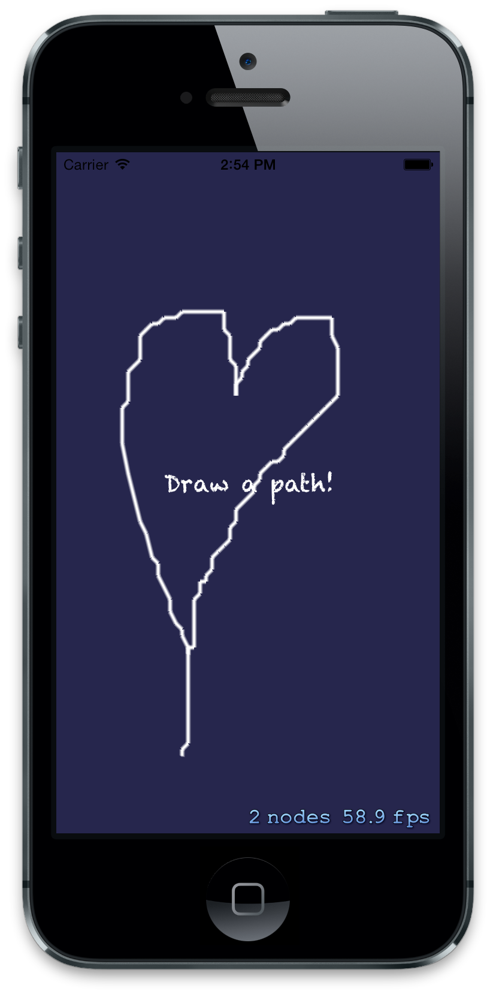

PathKit
=======

PathKit provides path drawing capabilities for iOS SpriteKit.



## Overview

PathKit lets your users draw paths with their finger.

### Typical usage

As per the [example code](https://github.com/matryer/PathKit/blob/master/PathKitExample/PathKitExample/MyScene.m), it is recommended that you use `touchesBegan:withEvent:`, `touchesEnd:withEvent:` and `touchesMoved:withEvent:` to allow interactions with your `PKPathNode`.

More advanced users may decide to interact with the `PKPath` directly, but the `PKPathNode` is a SpriteKit friendly `SKShapeNode` that draws the path on the screen for the user.

### Features

#### Tolerance

You are able to specify a tolerance (a `CGSize` describing a grid of tolerances), which represents the minimum distance the finger must travel in order for a new point to be added to the path.  This helps limit the resolution of paths that can otherwise become memory consuming.

```
self.pathNode = [[PKPathNode alloc] initWithTolerance:CGSizeMake(10, 10)];
```

## Snippets

### Creating and adding a PKPathNode

From within a `SKScene`:

```
// make a new path node
PKPathNode *pathNode = [[PKPathNode alloc] initWithTolerance:CGSizeMake(10, 10)];

// use self as the delegate (optional) see below
[pathNode setDelegate:self];

// add the child node to SpriteKit
[self addChild:pathNode];
```

### Adding points

Once you have created your PKPath, adding points in response to user interactions can be achieved by implementing the touchesMoved:withEvent: selector:

```
- (void) touchesMoved:(NSSet *)touches withEvent:(UIEvent *)event {
  
  // get the location in this SpriteKit scene
  CGPoint touchPosition = [[touches anyObject] locationInNode:self];
  
  // add it to the PKPathNode
  [self.pathNode addPoint:touchPosition];
  
}
```

## PKPathNodeDelegate

The `PKPathNodeDelegate` provides optional selectors that you can take advantage of to further customize the behaviour of the PKPathNode.

```
/**
 * Called when the PKPathNode creates a new path.
 * 
 * This is the perfect place to do any additional configuration on the 
 * PKPath before points are added to it.
 */
- (void)pathNode:(PKPathNode *)node didCreateNewPath:(PKPath *)path;

/**
 * If defined, will be called when the PKNodePath needs a CGPathRef for the
 * specified path.  Otherwise, the default path joining all points will be used.
 *
 * PKNodePath will release the returned CGPathRef when it is finished with it.
 */
- (CGPathRef)pathNode:(PKPathNode *)node makeCGPathForPKPath:(PKPath *)path;
```

## PKPath

#### PKPathChangedBlock

Passing a block to `initWithTolerance:pathChangedBlock:` will cause the block to be called every time there is a significant change to the path, allowing you to take appropriate action.

#### useToleranceAsMaximumDistance = YES

Setting `useToleranceAsMaximumDistance` to `YES` will mean that no two points in the path will be any further away from each other, than the specified tolerance.  This is useful if you want to keep all legs of the path a similar length.

#### snapStartPointToTolerance = YES

Settings `snapStartPointToTolerance` to `YES` will cause the start point to be snapped to the nearest grid point as specified by the tolerance size.  This ensures that your paths will strictly adhear to the grid.
